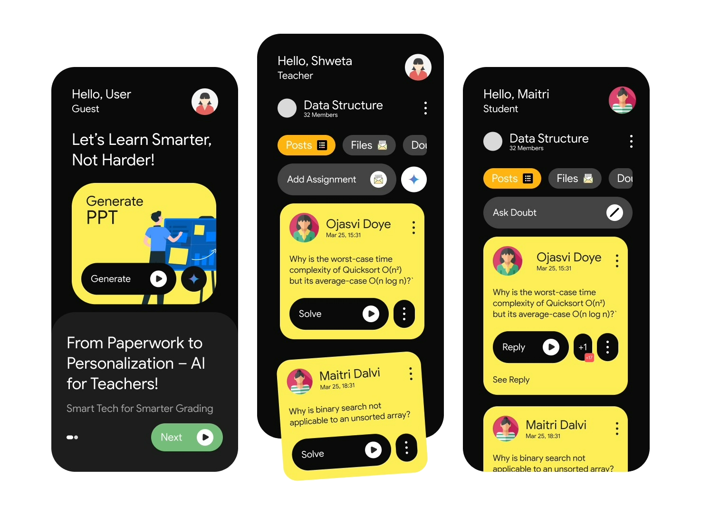

# 👩🏻‍🏫 GradGenius: Smart Tech for Smarter Grading

An AI-driven solution designed to support overburdened educators by automating assignment grading and delivering personalized feedback to students. This tool enhances the teaching process, promotes individual learning experiences, and aligns with UN SDG 4: Quality Education by ensuring inclusive and equitable educational opportunities.

---

---

<h2>Features</h2>
<ul>
  <li>🧠 Generate lecture notes and presentations using AI</li>
  <li>📝 Create quizzes and assignments automatically</li>
  <li>📊 Auto-grade student responses for quizzes and assignments</li>
  <li>🧾 Provide personalized feedback to each student</li>
  <li>💼 Reduce teacher workload and enhance productivity</li>
  <li>🎯 Aligns with <strong>UN SDG 4: Quality Education</strong></li>
</ul>

---
